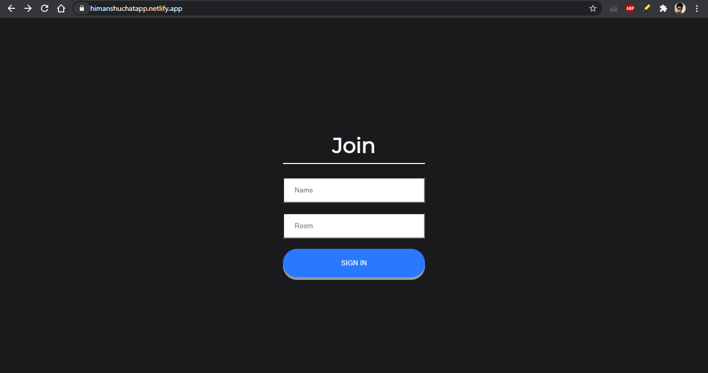
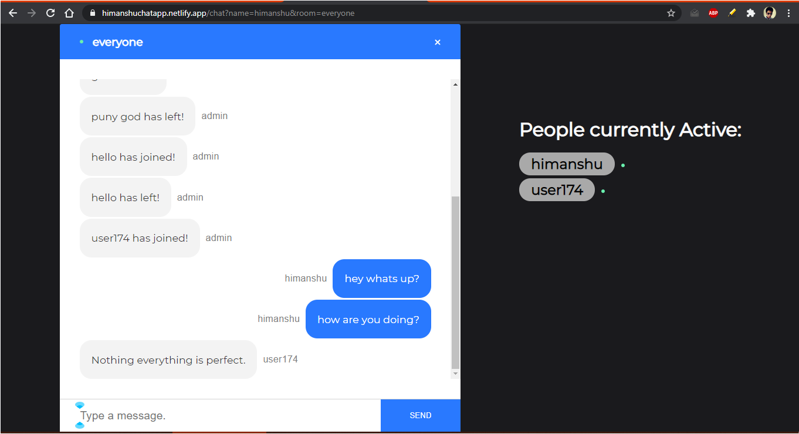

# ChatApp

[]

<em>
  
  :zap: Are you trying to chat with your friends but want to stay anonymous?  
  :zap: Do you want the applicaiton to run anywhere?  
  :zap: Are you tired of logging in and doing user authentication.  
  :zap: A chat App is here for you build with technologies like **React, Socket.io, Node.js**?  

</em>

***We have a solution!***

ChatApp is an app build for this purpose. You can create rooms as you go and invite your friends to join the room.   No messages are saved on the server and unlike other chat Apps we d not maintain user sessions.

 

## Visit :checkered_flag:

* Live: [https://himanshuchatapp.netlify.app/](https://himanshuchatapp.netlify.app/)

## Snapshots :computer:

*`the joining page` in view:*

*`the chat page` in view:*

